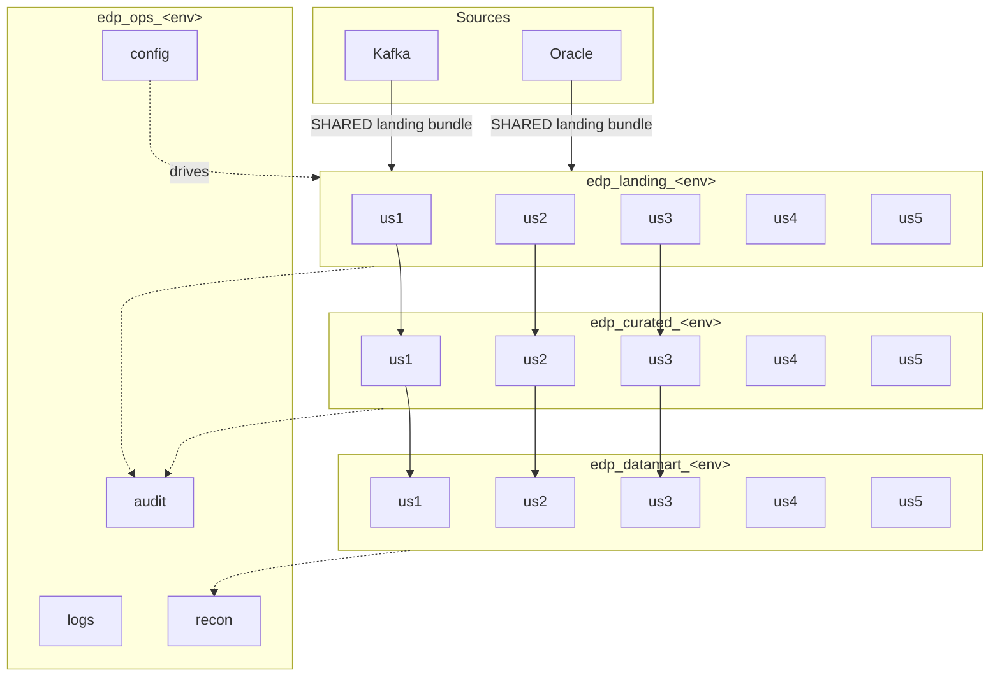

# Start here

This repository is the **reference implementation** for how the EDP team builds and
ships Databricks work: Databricks Asset Bundles for deployment, Azure DevOps for
source control and release gating, three environments, four catalogs per
environment, five use cases, ten developers.

It is also a **migration** framework. We are lifting and shifting from Cloudera, so
the structure carries two things a greenfield project would not: a `ported/` zone
where Cloudera code lands before it is refactored, and a reconciliation harness that
proves Databricks produces the same numbers Cloudera did.

Everything here runs. Tests pass, pipelines are complete, the audit scripts are
real. The only placeholders are workspace URLs, service principal GUIDs and
subscription IDs — every one marked `# PLACEHOLDER`.

> **Naming note.** Databricks renamed *Databricks Asset Bundles* to *Declarative
> Automation Bundles* in the 2026 documentation. Same product, same
> `databricks bundle` CLI. You will see both names in search results.

---

## Read this much, depending on who you are

### I am a developer joining a use-case team

About 45 minutes, and you will be able to ship.

1. [01 — Architecture](01-architecture.md) — the catalogs, the bundles, who owns what
2. [03 — Developer guide](03-developer-guide.md) — set up your laptop, deploy your sandbox
3. [02 — Branching strategy](02-branching-strategy.md) — how your work reaches production
4. [09 — Walkthrough](09-walkthrough-simulation.md) — watch two developers do it end to end
5. [04 — Bundle authoring](04-bundle-authoring.md) — when you need to add a job

Keep [08 — Troubleshooting](08-troubleshooting.md) open in a tab.

### I am porting Cloudera code

Read the developer path above, then:

6. [14 — Porting guide](14-porting-guide.md) — the two-zone model and how code leaves `ported/`
7. [13 — Migration and cutover](13-migration-and-cutover.md) — how parity is proven

### I am a lead setting this up

1. [01 — Architecture](01-architecture.md)
2. [06 — Environments and access](06-environments-and-access.md) — catalogs, service principals, grants
3. [05 — CI/CD pipelines](05-cicd-pipelines.md) — service connections, environments, gates
4. [02 — Branching strategy](02-branching-strategy.md) — branch policies to configure
5. [07 — Release process](07-release-process.md) — what you approve and when
6. [13 — Migration and cutover](13-migration-and-cutover.md) — the go-live gate

Then run [`scripts/setup/Az-DevOps-Bootstrap.ps1`](../scripts/setup/Az-DevOps-Bootstrap.ps1).

### I am QA

1. [07 — Release process](07-release-process.md) — where you fit, what to test
2. [13 — Migration and cutover](13-migration-and-cutover.md) — reading parity results
3. [01 — Architecture](01-architecture.md) — enough to know which catalog you are in

---

## The shape of it



**One bundle lands everything. One bundle per use case curates and marts it.**

---

## The seven bundles

| Bundle | Owns | Deploys | Owner |
|---|---|---|---|
| [`_platform`](../bundles/_platform) | 4 catalogs × 3 envs, all schemas, volumes, secret scopes, `ops.*` DDL | **first, always** | Platform leads |
| [`landing`](../bundles/landing) | Kafka + Oracle into `edp_landing_<env>.<use_case>` | second | Landing team |
| [`us1`](../bundles/us1) | curated + datamart for us1 (Kafka) | independent | us1 team |
| [`us2`](../bundles/us2) | curated + datamart for us2 (Oracle) | independent | us2 team |
| [`us3`](../bundles/us3) | curated + datamart for us3 (Kafka) | independent | us3 team |
| [`us4`](../bundles/us4) | curated + datamart for us4 (Kafka) | independent | us4 team |
| [`us5`](../bundles/us5) | curated + datamart for us5 (Kafka — **unconfirmed**) | independent | us5 team |

Plus two shared wheels: [`libs/dab_common`](../libs/dab_common) (config, audit,
quality, recon — used by everything) and
[`libs/edp_landing`](../libs/edp_landing) (the landing framework).

---

## Repository map

```
bundles/
  _platform/   catalogs, schemas, volumes, secret scopes, ops DDL
  landing/     SHARED - conf/<use_case>/sources.yml, one job per use case
  us1/ .. us5/ curated + datamart + reconciliation, per use case
    conf/reconciliation.yml     what parity means for this use case
    resources/                  curated.job.yml, datamart.job.yml, recon.job.yml
    src/ported/                 Cloudera code, lifted as-is  <- migration zone
    src/<uc>_module/            refactored, unit-tested
    src/jobs/                   thin entry points
    src/sql/                    mart definitions
    src/ddl/                    layer contracts (reference)
    tests/
libs/
  dab_common/  config, audit, quality, recon        <- every bundle depends on this
  edp_landing/ registry, kafka, oracle              <- the landing framework
.azure-pipelines/  ci-pr-validation + one cd-* per bundle
scripts/dev/       everyday developer commands (PowerShell)
scripts/setup/     one-time Azure DevOps bootstrap
scripts/ci/        validation used by PR builds and Validate-All.ps1
templates/         bundle init scaffold for a new use case
docs/              you are here
```

---

## The six decisions everything else follows from

1. **Four catalogs per environment, schemas per use case.** `edp_curated_prod.us1`.
   The env suffix is required, not cosmetic: one metastore serves all three
   workspaces, so catalog names must be unique metastore-wide.

2. **Landing is shared; curated and datamart are per use case.** Landing is a
   horizontal capability that will serve use cases that do not exist yet. Business
   logic belongs to a business domain.

3. **One bundle covers all its environments.** Never one bundle per environment.
   The difference between dev and prod is a `targets:` block and a set of variables.

4. **The dev workspace holds both sandboxes and shared nonprod.** Ten developers
   deploy the same bundles, isolated by `mode: development` and a per-user schema
   prefix.

5. **The gate is on the Azure DevOps Environment, not in the YAML.** A developer
   cannot remove an approval by editing a file in a PR.

6. **Parity is evidence, not opinion.** Every use case reconciles against Cloudera
   and writes the result to `edp_ops_<env>.recon`. Cutover is a query, not a
   meeting.

---

## Common commands

```bash
pwsh ./scripts/dev/Deploy-Sandbox.ps1 -Bundle us1
```

```bash
pwsh ./scripts/dev/Validate-All.ps1
```

```bash
databricks bundle run us1_curated --target dev
```

```bash
pwsh ./scripts/dev/Destroy-Sandbox.ps1 -Bundle us1
```

---

## Full document list

| # | Document | Read it when |
|---|---|---|
| 01 | [Architecture](01-architecture.md) | You want the shape of the whole thing |
| 02 | [Branching strategy](02-branching-strategy.md) | Before your first PR |
| 03 | [Developer guide](03-developer-guide.md) | Day one, laptop setup |
| 04 | [Bundle authoring](04-bundle-authoring.md) | Adding a job, pipeline or table |
| 05 | [CI/CD pipelines](05-cicd-pipelines.md) | Setting up or debugging a pipeline |
| 06 | [Environments and access](06-environments-and-access.md) | Catalogs, SPs, grants, secrets |
| 07 | [Release process](07-release-process.md) | Cutting or approving a release |
| 08 | [Troubleshooting](08-troubleshooting.md) | Something just failed |
| 09 | [Walkthrough](09-walkthrough-simulation.md) | You learn best by watching |
| 10 | [Onboarding checklists](10-onboarding-checklist.md) | Someone new is joining |
| 11 | [FAQ](11-faq.md) | "But can I just…?" |
| 12 | [Conventions](12-conventions.md) | Naming anything |
| 13 | [Migration and cutover](13-migration-and-cutover.md) | Proving parity, going live |
| 14 | [Porting guide](14-porting-guide.md) | Moving Cloudera code in |
| 13 | [Migration and cutover](13-migration-and-cutover.md) | Proving parity, going live |
| 14 | [Porting guide](14-porting-guide.md) | Moving Cloudera code in |
