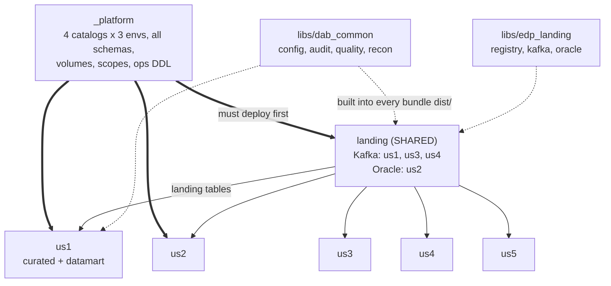

# 01 — Architecture

[← Start here](00-START-HERE.md)

---

## 1. Three workspaces, twelve catalogs

Databricks recommends two workspaces up to about five engineers and three beyond
that. With ten developers across five use cases, three is right.

| Environment | Workspace | Catalogs |
|---|---|---|
| **nonprod** | `adb-…0001` | `edp_landing_nonprod`, `edp_curated_nonprod`, `edp_datamart_nonprod`, `edp_ops_nonprod` |
| **preprod** | `adb-…0002` | `edp_*_preprod` |
| **prod** | `adb-…0003` | `edp_*_prod` |

### Why four catalogs and not one

A catalog per layer means a grant is a layer-wide decision. Business analysts get
`USE CATALOG` on `edp_datamart_prod` and nothing else — they cannot see curated
intermediate tables even by accident, because those live in a catalog they have no
grant on at all. With a single catalog and layer-schemas, the same isolation
depends on nobody ever granting at catalog level.

`edp_ops_*` separates operational metadata from data entirely, so support can be
given full audit visibility with zero data access.

### Why the environment suffix is required

One Unity Catalog metastore serves all three workspaces, so catalog names must be
unique **metastore-wide**. `edp_curated` in two workspaces would be one catalog.
The suffix is what makes them three.

### Schemas

Inside the three **data** catalogs, one schema per use case:

```
edp_curated_prod
  ├─ us1
  ├─ us2
  ├─ us3
  ├─ us4
  └─ us5
```

Inside **ops**, schemas are functional, because audit and config are cross-cutting
and no use case owns them:

```
edp_ops_prod
  ├─ audit    job_run, table_load, data_quality_result
  ├─ config   landing_source, landing_watermark
  ├─ logs     application_log
  └─ recon    parity_run, parity_check_result, parity_exception, cutover_readiness
```

### Sub-use-cases

Cloudera repos are split by use case *and* sub-use-case. Sub-use-cases are a
**code** boundary here, not a schema boundary:

```
bundles/us1/src/us1_module/billing/
bundles/us1/src/us1_module/claims/
```

Everything for us1 still lands in `edp_curated_<env>.us1`. If two sub-use-cases
need separate tables, that is a table-name prefix (`billing_invoice`,
`claims_settlement`), not a new schema. Five use cases already give you 15 data
schemas; multiplying by sub-use-case makes the grant matrix unmanageable for no
isolation benefit.

---

## 2. Seven bundles



| Bundle | Why it is its own bundle |
|---|---|
| `_platform` | Shared infrastructure with a different change cadence and a different owner |
| `landing` | Horizontal capability serving every use case, including future ones |
| `us1`–`us5` | A use case is the natural release unit and the natural ownership boundary |

### Why a use case is one bundle, not two

us1's curated and datamart changes almost always ship together — a new column in
curated exists to feed a mart. Splitting them would double the pipelines and the
gates to buy independence nobody exercises.

The counter-case: if your datamart layer is genuinely owned by a different team
with a different release cadence, split it. Nothing in the structure prevents that
— see [04 §8](04-bundle-authoring.md#8-adding-a-whole-new-use-case).

### Deploy order

`_platform` **must** succeed in an environment before anything else deploys there.
Everything assumes its catalogs, schemas and `ops.*` tables exist.

Databricks guidance is explicit: model a bundle-to-bundle dependency in the
**CI/CD layer**, not by collapsing bundles. Here that means `cd-platform` is a
documented prerequisite, not a YAML `dependsOn` — see
[07](07-release-process.md#7-new-environment).

`landing` should deploy before the use cases too, but that ordering is soft: a use
case deploying first simply has nothing to read yet.

---

## 3. Landing is shared — and what that costs

Landing is one bundle serving all five use cases. That is the right call, and it
has a real cost worth naming.

**The benefit.** One Kafka reader, one Oracle framework, one source registry. A
sixth use case arriving on Kafka writes a config file, not a framework.

**The cost.** A change for us1 redeploys landing for us2–us5 as well. A bad landing
deploy affects everyone at once.

**The mitigations, all three of which are in the repo:**

| Mitigation | Where |
|---|---|
| Per-use-case config folders with their own reviewers | `bundles/landing/conf/us1/` + [`CODEOWNERS`](../CODEOWNERS) |
| One job per use case, so runtime is independent | `resources/landing_us1.job.yml` … `landing_us5.job.yml` |
| Framework in `libs/`, so splitting later is cheap | [`libs/edp_landing`](../libs/edp_landing) |

Onboarding a us3 topic needs a **us3** reviewer, not a landing one. That is what
stops a shared bundle becoming a shared bottleneck.

If landing does become one, split it: the framework already lives in `libs/`, so a
`bundles/landing_us1/` is a `databricks.yml` and a pipeline, not a rewrite.

---

## 4. The shared wheels

| Wheel | Contents | Depended on by |
|---|---|---|
| [`dab_common`](../libs/dab_common) | `config`, `audit`, `quality`, `recon` | **every** bundle |
| [`edp_landing`](../libs/edp_landing) | `registry`, `kafka`, `oracle` | landing (and any use case reading the registry) |

They are wheels rather than shared notebooks for one reason: **they can be unit
tested**. Both test suites run in PR validation on an agent with no cluster, no
Spark and no Java, in a couple of seconds.

The design rule that makes that possible: *nothing at import time touches Spark*.
Every function needing a session takes it as its first argument, and all SQL and
predicate construction is pure.

### How a wheel reaches a job

DABs requires library paths inside the bundle root, so both shared wheels are
**built into each bundle's `dist/`**:

```
libs/dab_common  ──build──▶  bundles/us1/dist/dab_common-0.4.0-py3-none-any.whl
libs/edp_landing ──build──▶  bundles/us1/dist/edp_landing-0.4.0-py3-none-any.whl
```

Done by [`build-wheels.yml`](../.azure-pipelines/templates/steps/build-wheels.yml)
in CI and [`Build-Wheels.ps1`](../scripts/dev/Build-Wheels.ps1) locally. Each
bundle's *own* wheel is built by the bundle itself via `artifacts:`, so a local
deploy behaves identically to the pipeline.

Publishing to an Azure Artifacts feed is the right answer when use cases move to
separate repositories. It is the wrong answer today, because it decouples the
wheel version from the commit.

---

## 5. How ten developers share one workspace

Every developer deploys the same bundles to the `dev` target. Four mechanisms keep
them apart, and they compose:

| Mechanism | From | Effect |
|---|---|---|
| Job name prefix | `mode: development` | `[dev jsmith] us1_curated` |
| File root | `mode: development` | `/Workspace/Users/jsmith@…/.bundle/…` |
| Paused schedules | `mode: development` | Nothing of yours fires on a timer |
| **Schema prefix** | `${var.schema_prefix}` | `edp_curated_nonprod.jsmith_us1` |

The first three are free. The fourth isolates *data*, and is the one you configure:

```yaml
targets:
  dev:
    mode: development
    variables:
      env: nonprod                                        # a sandbox lives INSIDE nonprod
      schema_prefix: ${workspace.current_user.short_name}_ # -> "jsmith_"
  nonprod:
    mode: production
    variables:
      env: nonprod
      schema_prefix: ""                                    # -> shared "us1"
```

Every table name goes through `dab_common.config`:

```python
ctx.table("curated", "orders")
# jsmith's sandbox -> edp_curated_nonprod.jsmith_us1.orders
# shared nonprod   -> edp_curated_nonprod.us1.orders
# prod             -> edp_curated_prod.us1.orders
```

Same code. No `if env == "prod"` anywhere in the repo.

### The one rule

**Every schema this framework touches is prefixed in a sandbox — ops included.**
`jsmith_audit`, `jsmith_config`, `jsmith_recon`.

That is not tidiness. `ops.config` holds the landing source registry; if it were
shared, a developer seeding their own test sources would overwrite the registry
that shared nonprod jobs read from. One rule, no exceptions, no footgun.

### Why sandbox schemas are created at runtime

You might expect sandbox schemas to be `resources.schemas` entries. They are not.

In `mode: development`, DABs prefixes **resource names** with `[dev jsmith] `.
Applied to a schema, that yields `[dev jsmith] us1` — not a legal Unity Catalog
name. The deploy fails.

So shared schemas are declared once in `_platform` (which has no development-mode
target), and sandbox schemas are created idempotently at runtime by
`dab_common.config.ensure_schema()`, which no-ops outside a sandbox. See
[08](08-troubleshooting.md#schema-prefix).

---

## 6. The migration layer

Two things exist here that a greenfield project would not have.

### `src/ported/` — the lift-and-shift zone

Each use case has one. Cloudera code lands there near as-is and runs as notebook
tasks: no package structure required, no unit tests required.

That is deliberate. Demanding a full refactor before anything can run is how a
migration stalls — teams under deadline route around the structure instead. The
zone is visible in the tree, so "ported" cannot quietly become permanent.

Full model, and the exit criteria: [14 — Porting guide](14-porting-guide.md).

### `ops.recon` — the parity evidence base

Every use case has a `conf/reconciliation.yml` declaring what parity means for it,
and a `<uc>_reconcile` job that measures both platforms and writes the comparison
to `edp_ops_<env>.recon`.

For a lift and shift the client's real question is not "did it deploy?" but "does
Databricks produce the same numbers?". These tables are the answer, and
`cutover_readiness` turns go-live from a judgement call into a query.

Full model: [13 — Migration and cutover](13-migration-and-cutover.md).

---

## 7. Identities

Two kinds of service principal, deliberately separated.

| | Deploy SP | Run-as SP |
|---|---|---|
| Used by | The Azure DevOps pipeline | The job at execution time |
| Authenticates via | Workload identity federation (no secret) | Databricks `run_as` |
| Needs | `CAN_MANAGE` on the deployment folder, job creation | UC grants on exactly the data its workload touches |
| Does **not** need | Access to production data | Any deployment rights |

If a job is compromised it cannot deploy code. If the pipeline is compromised it
cannot read data.

In a sandbox there is no SP: the `dev` target sets no `run_as`, so jobs run as the
developer under the developer's own grants. A developer cannot accidentally use
production data access they do not personally have.

Full grant matrix: [06](06-environments-and-access.md).

---

## 8. What is NOT in bundles

| Thing | Where | Why |
|---|---|---|
| Cluster policies | Admin UI / Terraform | Not a bundle resource type. Looked up by name. |
| SQL warehouses | Admin UI / Terraform | Shared infrastructure; looked up by name. |
| Secret **values** | Azure Key Vault | The bundle creates the *scope*; values never touch git. |
| Workspaces, metastore | Cloud platform team | Provisioned long before this repo. |
| ADO environments and gates | Azure DevOps settings | So a PR cannot remove a gate. |

The convention that makes lookups work: **the object carries the same name in all
three workspaces**, and only its ID differs.

---

## 9. Three compute styles, on purpose

| Where | Compute | Why |
|---|---|---|
| landing (Oracle) | Job cluster + policy | Long, JDBC-bound, benefits from tuning and partitioned reads |
| landing (Kafka) | Declarative pipeline cluster | The pipeline owns checkpointing and restart |
| curated | **Serverless** | Short and bursty; cluster startup would dominate |
| datamart | **DBSQL warehouse** + serverless | SQL belongs on a warehouse; the audit task needs Python |

Guidance: [04 §3](04-bundle-authoring.md#3-compute).

---

[← Start here](00-START-HERE.md) · [Next: Branching strategy →](02-branching-strategy.md)
