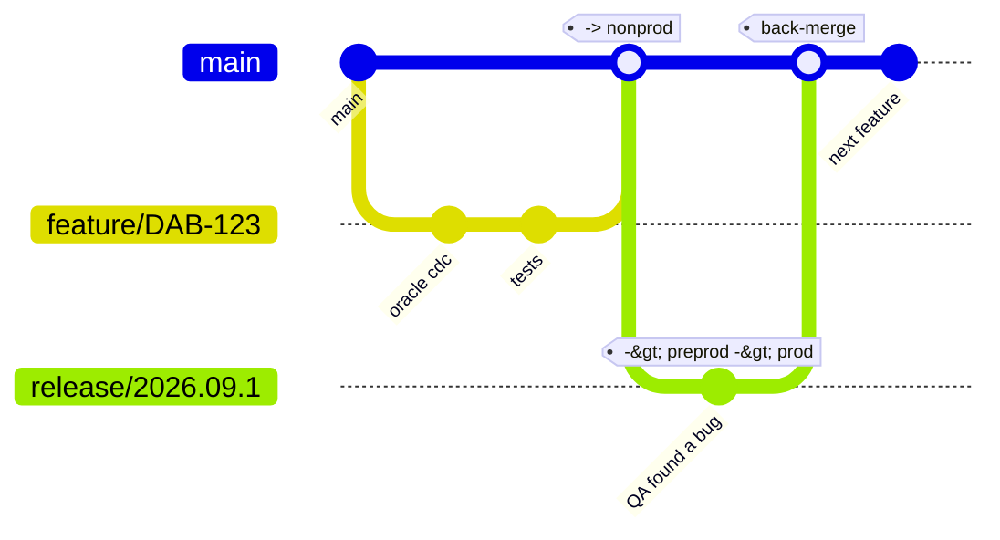

# 02 — Branching strategy

[← Architecture](01-architecture.md) · [Start here](00-START-HERE.md)

---

## The model

One long-lived branch, `main`. Short-lived feature branches. A release branch per
release, promoted through preprod and prod by **approval gates rather than by more
merges**.



| Branch | Lifetime | Protected | Deploys to | How |
|---|---|---|---|---|
| `feature/<TICKET>-<slug>` | days | no | your personal sandbox | you run the CLI |
| `bugfix/<TICKET>-<slug>` | days | no | your personal sandbox | you run the CLI |
| `main` | forever | **yes** | shared nonprod | automatic on merge |
| `release/<yyyy.MM.n>` | one release | **yes** | preprod → prod | automatic to preprod, gated to prod |
| `hotfix/<TICKET>-<slug>` | hours | no | via a new `release/*` | same path as a release |

---

## Why this and not a branch per environment

You previously had `dev`, `preprod` and `prod` branches with a PR between each. That
model is familiar and it works, but with DABs it costs you something specific.

**With environment branches**, the code in preprod is whatever happens to be on the
`preprod` branch. A bug fixed directly on `preprod` may never reach `dev`. Six months
later `dev` and `preprod` have quietly diverged, and nobody can say what is actually
running in production without diffing three branches.

**With release branches**, there is exactly one artifact. `release/2026.09.1` is cut
from `main`, and *that commit* goes to preprod. QA tests it. The same commit, with
the same wheels, goes to prod. Production runs the thing QA approved — not a
re-merge of it.

The approval gates you had are unchanged. They just moved from "a PR into a branch"
to "an Azure DevOps Environment check", which is strictly better: a gate on an
Environment cannot be removed by editing a file in a PR.

> **Databricks' own guidance** is trunk-based: keep `main` always deployable and
> minimise long-lived branches. Release branches are the minimum deviation from that
> which still gives you a client approval gate on a fixed artifact.

### Two rules that keep it honest

1. **Preprod and prod fixes are commits on the release branch.** Never a change made
   in a workspace, never a branch cut from preprod. If you fix something in the
   Databricks UI, it is gone at the next deploy.

2. **A back-merge PR from `release/*` to `main` is mandatory** before the release is
   closed. Without it the next release silently reverts the fix. This is the single
   discipline the whole model depends on — see [§6](#6-back-merges).

---

## 1. Branch naming

```
feature/DAB-123-oracle-cdc-support
bugfix/DAB-456-null-customer-key
hotfix/DAB-789-watermark-regression
release/2026.09.1
```

- Prefix is one of `feature`, `bugfix`, `hotfix`, `release`.
- The ticket ID comes second and is **required** — the work-item-linking branch
  policy will reject a PR without one.
- Then a short kebab-case slug. Keep it under about 50 characters total.
- Release branches are `release/<year>.<month>.<sequence>`, so `2026.09.1` is the
  first September release. The sequence resets each month.

---

## 2. The daily loop

```bash
git checkout main
git pull
git checkout -b feature/DAB-123-oracle-cdc-support
```

Work. Deploy to your sandbox as often as you like — it costs nothing and disturbs
nobody:

```bash
pwsh ./scripts/dev/Deploy-Sandbox.ps1 -Bundle landing -Run landing_us2
```

Before you push, run what the build agent will run:

```bash
pwsh ./scripts/dev/Validate-All.ps1
```

That is lint, unit tests, bundle structure and the cross-reference audit — the same
four checks, in the same order, as
[`ci-pr-validation.yml`](../.azure-pipelines/ci-pr-validation.yml). Ten seconds
locally beats ten minutes of build-agent round trips.

Then push and open a PR into `main`.

---

## 3. Pull requests into `main`

Branch policies (configured by
[`Az-DevOps-Bootstrap.ps1`](../scripts/setup/Az-DevOps-Bootstrap.ps1)):

| Policy | Setting | Why |
|---|---|---|
| Minimum reviewers | 2 | One team member, one lead |
| Creator vote counts | **off** | You cannot approve your own work |
| Reset votes on push | **on** | An approval applies to the code that was reviewed |
| Build validation | `ci-pr-validation` must pass | Nothing merges red |
| Work item linking | required | Every change traceable to a ticket |
| Comment resolution | required | Review feedback cannot be merged past |
| Automatically included reviewers | from [`CODEOWNERS`](../CODEOWNERS) | The owning team sees changes to their module |

### What the reviewer is actually checking

The build already checked syntax, lint and tests. A human review should be looking
for the things a machine cannot:

- Does a change under `libs/` account for **all three** modules that depend on it?
- Are new tables, jobs and schemas named per [12 — Conventions](12-conventions.md)?
- Are environment-specific values in `variables.yml`, not hardcoded in a resource file?
- Does a new job pass the five base parameters (`env`, `use_case`, `catalog_prefix`, `schema_prefix`, `bundle_target`)?
- Is a new source in `conf/<use_case>/sources.yml` sensible — right strategy, right watermark, an owner?
- If a schedule changed, does it still fit the ingestion → curation → datamart order?

### Merge strategy

**Squash merge.** One commit on `main` per PR, titled with the ticket ID. This makes
`git log main` a readable release note and makes a revert a single commit.

On merge, `cd-<module>` runs automatically and deploys to shared nonprod.

---

## 4. Cutting a release

When `main` holds everything the release should contain:

```bash
git checkout main
git pull
git checkout -b release/2026.09.1
git push -u origin release/2026.09.1
```

Pushing the branch triggers every `cd-*` pipeline whose paths changed, which builds
and then waits at the **preprod gate**. A lead approves; preprod deploys; QA starts.

The prod stage then waits at the **client gate**. Nothing has deployed to production
yet, and nothing will until a client approver clicks approve.

Full detail, including who does what: [07 — Release process](07-release-process.md).

---

## 5. Fixing a bug found in preprod

This is the flow that most often gets done wrong. The bug is in preprod; the fix
goes on the **release branch**:

```bash
git checkout release/2026.09.1
git pull
git checkout -b bugfix/DAB-456-null-customer-key

# fix it, test it in your sandbox
pwsh ./scripts/dev/Deploy-Sandbox.ps1 -Bundle us1 -Run us1_curated
pwsh ./scripts/dev/Validate-All.ps1

git push -u origin bugfix/DAB-456-null-customer-key
```

Open a PR **into `release/2026.09.1`** — not into `main`. On merge the release
pipeline runs again, redeploys preprod, and QA retests.

> **Do not fix it in the Databricks UI.** A workspace edit is overwritten by the
> next deploy and exists in no branch. If you have already done it, reproduce the
> change in code before you forget what it was.

Then, immediately: [back-merge](#6-back-merges).

---

## 6. Back-merges

**Every commit that lands on a `release/*` branch must reach `main`.** A fix that
does not is a bug you will ship again next month.

```bash
git checkout main
git pull
git checkout -b backmerge/release-2026.09.1
git merge origin/release/2026.09.1
# resolve conflicts if main has moved on
pwsh ./scripts/dev/Validate-All.ps1
git push -u origin backmerge/release-2026.09.1
```

Open a PR into `main` titled `Back-merge release/2026.09.1`.

The release is not closed until that PR is merged. The release checklist in
[07](07-release-process.md#the-release-checklist) has it as an explicit item, and
the prod stage of the pipeline is the natural place to enforce it if you want a
hard gate — see [05 — CI/CD pipelines](05-cicd-pipelines.md#enforcing-the-back-merge).

### Why not merge `release/*` back automatically

You can, and some teams do. It is left manual here because a back-merge frequently
*conflicts* — `main` has moved on, and the fix has to be reconciled with newer code
by someone who understands both sides. An automatic merge that silently resolves
that badly is worse than a PR someone has to look at.

---

## 7. Hotfixes

A production incident. The fix must go out now, and `main` contains a half-finished
feature you cannot ship.

Branch from the **tag** of what is running in production, not from `main`:

```bash
git checkout -b hotfix/DAB-789-watermark-regression v2026.09.1
# fix, test in sandbox, validate
git push -u origin hotfix/DAB-789-watermark-regression
```

PR into a **new release branch** cut from the same tag:

```bash
git checkout -b release/2026.09.2 v2026.09.1
git push -u origin release/2026.09.2
```

That release branch then follows the normal path — preprod, leads approve, QA smoke
test, client approves, prod. The gates stay. An incident is a bad reason to skip
them, and this path is fast enough that you do not need to.

Then back-merge `release/2026.09.2` into `main`.

---

## 8. Tags

The prod stage tags the deployed commit:

```
v2026.09.1
```

The tag is what production is running. It is the branch point for the next hotfix,
and it is what you diff against to answer "what changed since the last release".

---

## 9. What triggers what

| Event | Pipeline | Deploys to | Gate |
|---|---|---|---|
| PR opened / updated into `main` or `release/*` | `ci-pr-validation` | nothing | — |
| Merge to `main` | `cd-<module>` | shared nonprod | none |
| Push to `release/*` | `cd-<module>` | preprod | leads |
| Same run, after preprod | `cd-<module>` | prod | client |
| Change under `libs/` | **every** `cd-*` | as above | as above |
| Change under `docs/` or any `*.md` | nothing | nothing | — |

Path filters live in each pipeline's `trigger.paths`. A shared-wheel change
deliberately rebuilds and redeploys every bundle, because all four embed that
wheel.

---

## 10. Branch policy summary to configure

On `main` **and** on `release/*` (a wildcard policy):

- [x] Require a minimum of 2 reviewers
- [x] Prohibit the most recent pusher from approving
- [x] Reset all approval votes when new changes are pushed
- [x] Check for linked work items — required
- [x] Check for comment resolution — required
- [x] Build validation: `ci-pr-validation`, blocking, expires after 12 hours
- [x] Automatically included reviewers matching [`CODEOWNERS`](../CODEOWNERS)
- [x] Limit merge types to **squash merge** only
- [x] Restrict who can push directly — nobody; everything goes through a PR

`Az-DevOps-Bootstrap.ps1` applies most of these. The wildcard `release/*` policy and
the automatic-reviewer rules are added in the UI — see
[05 — CI/CD pipelines](05-cicd-pipelines.md).

---

[← Architecture](01-architecture.md) · [Next: Developer guide →](03-developer-guide.md)
