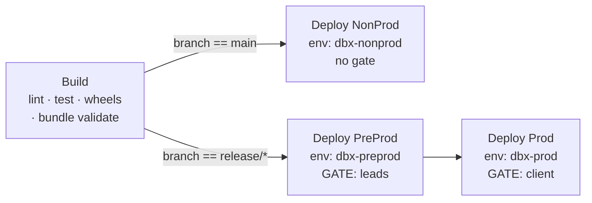

# 05 — CI/CD pipelines

[← Bundle authoring](04-bundle-authoring.md) · [Start here](00-START-HERE.md)

---

## 1. Five pipelines

| Pipeline | Trigger | What it does |
|---|---|---|
| [`ci-pr-validation`](../.azure-pipelines/ci-pr-validation.yml) | PR into `main` or `release/*` | Lint, test, validate. **Never deploys.** |
| [`cd-platform`](../.azure-pipelines/cd-platform.yml) | push to `main` / `release/*` under `bundles/_platform/` | Deploys the 4 catalogs, all schemas, `ops.*` DDL |
| [`cd-landing`](../.azure-pipelines/cd-landing.yml) | same, under `bundles/landing/` | Deploys the ingestion bundle |
| [`cd-us1`](../.azure-pipelines/cd-us1.yml) | same, under `bundles/us1/` | Deploys the curation bundle |
| [`cd-us1`](../.azure-pipelines/cd-us1.yml) | same, under `bundles/us1/` | Deploys the datamart bundle |

One pipeline per bundle. Independent deploys, independent history, independent
approval gates. A change to `bundles/us1/` runs exactly one pipeline.

A change under `libs/` runs **all four**, because all four embed that wheel.

`cd-landing.yml` carries the full commentary; the other three are structurally
identical with three lines changed.

---

## 2. The CD pipeline, stage by stage



| Stage | Condition | Environment | Steps |
|---|---|---|---|
| `Build` | always | — | ruff → pytest → build `dab_common` wheel → publish it → `bundle validate -t nonprod` |
| `DeployNonProd` | `refs/heads/main` | `dbx-nonprod` | download wheels → validate → deploy → smoke run |
| `DeployPreProd` | `refs/heads/release/*` | `dbx-preprod` | same, target `preprod` |
| `DeployProd` | `refs/heads/release/*`, after PreProd | `dbx-prod` | same, target `prod` |

### Why the same artifact reaches prod

Two mechanisms, and both matter:

**Same commit.** Every stage of one pipeline run does `checkout: self` at the commit
that triggered the run. Azure DevOps guarantees that. Prod cannot deploy a different
commit than preprod did — there is no re-trigger between them.

**Same wheels.** The `Build` stage publishes `dist/` as a pipeline artifact. Every
deploy stage *downloads* it rather than rebuilding. Prod installs the exact binary
QA tested — not a rebuild of the same source, which is not the same thing when a
transitive dependency has moved.

**Prod depends on PreProd, not on Build.** Prod can only ever deploy something that
already reached preprod and passed its gate.

---

## 3. Authentication — no secrets anywhere

Workload identity federation (OIDC). An `AzureCLI@2` task signs in via an ARM
service connection configured with federated credentials; the Databricks CLI's
credential chain then detects the active Azure CLI session and uses it.

```yaml
  - task: AzureCLI@2
    inputs:
      azureSubscription: dbx-preprod-svc-conn
      scriptType: bash
      scriptLocation: inlineScript
      workingDirectory: bundles/landing
      inlineScript: |
        databricks bundle deploy --target preprod
```

There is no token to store, rotate or leak. The service connection name is the only
thing that changes between environments.

### Setting up a service connection

Once per environment, by someone with Azure AD directory rights.

**In the Azure portal:**

1. **App registrations → New registration.** Name it `sp-edp-deploy-preprod`. Note
   the Application (client) ID and Directory (tenant) ID.
2. **Certificates & secrets → Federated credentials → Add credential.**
   - Scenario: *Other issuer*
   - Issuer: `https://vstoken.dev.azure.com/<your-ADO-organisation-GUID>`
   - Subject identifier: Azure DevOps generates this when you create the service
     connection — create the connection first (step 4), copy the values it shows, then
     come back and fill them in.
   - Audience: `api://AzureADTokenExchange`

**In Azure DevOps:**

3. **Project Settings → Service connections → New → Azure Resource Manager.**
4. Choose **Workload Identity federation (manual)**. Enter the subscription, tenant
   and the Application ID from step 1. Name it `dbx-preprod-svc-conn`. Save, then
   copy the Issuer and Subject identifier it displays back into step 2.
5. **Security → restrict the connection** to the `cd-*` pipelines only. Do **not**
   grant access to all pipelines — that would let a PR build reach preprod.

**In the Databricks workspace:**

6. **Settings → Identity and access → Service principals → Add**, using the same
   Application ID.
7. Grant it workspace entitlements and the Unity Catalog privileges in
   [06 — Environments and access](06-environments-and-access.md).

Repeat for nonprod and prod. Three app registrations, three service connections,
three service principals — never shared across environments.

### Fallback: client ID + secret

If your organisation has not enabled workload identity federation yet, the
commented block at the bottom of
[`bundle-deploy.yml`](../.azure-pipelines/templates/steps/bundle-deploy.yml) shows
the alternative:

```yaml
  - script: databricks bundle deploy --target preprod
    workingDirectory: bundles/landing
    env:
      DATABRICKS_HOST:          $(DATABRICKS_HOST)
      DATABRICKS_CLIENT_ID:     $(DATABRICKS_CLIENT_ID)
      DATABRICKS_CLIENT_SECRET: $(DATABRICKS_CLIENT_SECRET)
```

Store the secret in a **Key Vault-backed variable group**, never as a plain pipeline
variable, and rotate it on a schedule. Treat this as a temporary state.

---

## 4. Environments and approval gates

The gate lives on the Azure DevOps **Environment**, not in the YAML. The pipeline
says "deploy to `dbx-prod`"; Azure DevOps decides what `dbx-prod` requires.

That separation is the point: **a developer cannot remove a gate by editing a file in
a PR.**

### Creating them

**Pipelines → Environments → New environment.** Create `dbx-nonprod`, `dbx-preprod`,
`dbx-prod` (no resource, just the name).

Then on `dbx-preprod` and `dbx-prod`: **Approvals and checks → Add check → Approvals**.

| Setting | preprod | prod |
|---|---|---|
| Approvers | `edp-platform-leads` | `edp-client-approvers` |
| Minimum approvers | 1 | 1 |
| Requester cannot approve | **on** | **on** |
| Timeout | 30 days | 30 days |
| Instructions | "Confirm the release notes and that nonprod is green." | "Client sign-off. Confirm QA has completed preprod testing." |

Worth adding on `dbx-prod`:

- **Business hours** check — deployments only during an agreed window.
- **Exclusive lock** — only one run can hold prod at a time, so two releases cannot
  interleave.

`Az-DevOps-Bootstrap.ps1` creates the environments; the approval checks are added in
the UI because the checks REST API is awkward to script and this is a one-time task.

> ### An environment with no check is not a gate
>
> **Azure DevOps auto-creates any environment a pipeline references.** If nobody
> ever created `dbx-prod`, the first `cd-*` run against it creates it — with no
> checks — and deploys straight to production. Nothing fails. Nothing warns you.
> The gate you designed simply is not there, and the green run looks identical to
> a gated one.
>
> This is why `Az-DevOps-Bootstrap.ps1` **verifies the checks at the end and exits
> non-zero** if `dbx-preprod` or `dbx-prod` has no Approval. Do not deploy to
> either until that check passes. "The deploy succeeded" is not evidence that
> anyone approved it.

---

## 5. PR validation

[`ci-pr-validation.yml`](../.azure-pipelines/ci-pr-validation.yml) is what the Build
Validation branch policy points at. It **never deploys and never gets a service
connection** — a PR branch is untrusted code.

> ### `pr:` in YAML does nothing on Azure Repos
>
> Microsoft: *"For an Azure Repos Git repo, you cannot configure a PR trigger in
> the YAML file. You need to use branch policies."*
>
> A `pr:` block with `branches:` and `paths:` under it is **silently ignored** —
> which is worse than an error, because it reads like working configuration. A
> docs-only PR would still run the full build and nothing would explain why.
>
> So the file says `pr: none`, and **branch and path filtering live on the Build
> Validation policy**:
>
> ```bash
> az repos policy build create --repository-id $repoId --branch main >   --build-definition-id $prValidationId --display-name 'PR validation' >   --path-filter '/bundles/*;/libs/*;/.azure-pipelines/*;/scripts/*;/templates/*;/pyproject.toml' >   --blocking true --enabled true --queue-on-source-update-only true
> ```
>
> `check_pr_trigger_not_in_yaml` fails the build if a `pr:` block reappears.

> ### Path filters: `bundles/us1/*` is not what you want
>
> Wildcards are supported in path filters, and a single `*` **does not cross a
> `/`**. So `bundles/us1/*` matches `bundles/us1/databricks.yml` but **not**
> `bundles/us1/src/jobs/curate.py` — the pipeline stops triggering on the code it
> deploys, and the only symptom is a deploy that quietly never happens.
>
> Use the bare folder, which is the documented form for "this folder and
> everything under it":
>
> ```yaml
> paths:
>   include:
>     - bundles/us1          # not bundles/us1/*
>     - libs/dab_common
> ```
>
> `check_trigger_scope` rejects any `.../*` path filter.

It:

1. Diffs against the PR target branch to find what changed.
2. Resolves which bundles that touches. A change under `libs/`, `.azure-pipelines/`
   or the root `pyproject.toml` means **all** of them.
3. Runs `ruff check .`
4. Runs `pytest -m "not integration"` for the affected bundles.
5. Runs the [cross-reference audit](../scripts/ci/check_bundle_references.py).
6. Runs the [structural bundle check](../scripts/ci/validate_bundle_yaml.py) —
   offline, no workspace needed.

Full `databricks bundle validate` against a real workspace happens in the `Build`
stage of the CD pipeline, after merge, where a service connection is available.

### Wiring it to branch policies

**Repos → Branches → `main` → Branch policies → Build Validation → +**

| Setting | Value |
|---|---|
| Build pipeline | `ci-pr-validation` |
| Path filter | leave empty (the pipeline does its own change detection) |
| Trigger | Automatic |
| Policy requirement | Required |
| Build expiration | 12 hours |

Repeat for `release/*` — **Branches → … → Branch policies** on a wildcard.

---

## 6. What the audit scripts catch

Both run in PR validation and in `Validate-All.ps1`.

[`validate_bundle_yaml.py`](../scripts/ci/validate_bundle_yaml.py), per bundle:
- YAML parses
- all four targets exist, with the right `mode`
- exactly one target is `default: true`
- every target has a `workspace.host`
- every production-mode target sets `run_as`
- every `notebook_path` / `file` / `path` points at a file that exists
- every `${var.x}` used is declared (and it warns about declared-but-unused)

[`check_bundle_references.py`](../scripts/ci/check_bundle_references.py), repo-wide:
- every pipeline `template:` resolves
- every `bundlePath:` has a `databricks.yml`
- **every `runAfterDeploy:` names a job the bundle actually defines**
- every bundle has a CD pipeline (a bundle with no pipeline can never deploy)
- the pinned CLI version satisfies every bundle's `databricks_cli_version`
- every relative Markdown link resolves
- no real workspace URL or PAT has been committed

The `runAfterDeploy` check is the one that earns its keep: renaming a job is a
one-line change that silently breaks a smoke test in a stage that only runs at
release time.

---

## 7. Variable groups

**Pipelines → Library → Variable groups.** One per environment: `edp-nonprod`,
`edp-preprod`, `edp-prod`.

Only non-secret values. With workload identity federation there is no token at all,
and `DATABRICKS_HOST` is a workspace URL, not a secret.

| Variable | Example |
|---|---|
| `DATABRICKS_HOST` | `https://adb-0000000000000002.2.azuredatabricks.net` |

Restrict each group under **Security** to the pipelines that need it. `edp-prod`
should be reachable by `cd-*` only.

---

## 8. Enforcing the back-merge

The release process requires a back-merge PR from `release/*` to `main`
([02 §6](02-branching-strategy.md#6-back-merges)). If you want that enforced rather
than remembered, add a step to the prod stage:

```yaml
  - script: |
      set -euo pipefail
      BRANCH="$(echo "$(Build.SourceBranch)" | sed 's|refs/heads/||')"
      COUNT=$(az repos pr list \
        --source-branch "$BRANCH" --target-branch main \
        --status all --query "length(@)" -o tsv)
      if [ "$COUNT" -eq 0 ]; then
        echo "##vso[task.logissue type=error]No back-merge PR from $BRANCH to main."
        echo "Open one before deploying to production - see docs/02 section 6."
        exit 1
      fi
      echo "Back-merge PR found."
    displayName: "Verify a back-merge PR exists"
    env:
      AZURE_DEVOPS_EXT_PAT: $(System.AccessToken)
```

Left out of the shipped pipelines deliberately: it needs the build service account to
have PR read rights, which is an org policy decision. Turn it on once you have
decided.

---

## 9. Adding a pipeline for a new use case

```bash
cp .azure-pipelines/cd-landing.yml .azure-pipelines/cd-reconciliation.yml
```

Change exactly three things:

```yaml
name: cd-reconciliation-$(Date:yyyyMMdd)$(Rev:.r)     # 1
# ...
      - bundles/reconciliation                         # 2  (trigger paths)
# ...
      bundlePath: bundles/reconciliation               # 2  (every occurrence)
      runAfterDeploy: reconciliation_main              # 3  (a real job key)
```

Register it:

```bash
az pipelines create --name cd-reconciliation \
  --repository edp-databricks --repository-type tfsgit --branch main \
  --yml-path .azure-pipelines/cd-reconciliation.yml --skip-first-run true
```

The cross-reference audit will tell you if you missed something.

---

## 10. Debugging a pipeline

**Enable diagnostics.** Run the pipeline manually with *Enable system diagnostics*.

**Reproduce the deploy locally.** Everything the pipeline does you can run yourself —
against nonprod, where you have access:

```bash
cd bundles/landing
pwsh ../../scripts/dev/Build-Wheels.ps1 -Bundle landing
databricks bundle validate --target nonprod
```

**See what the CLI would change** without changing it:

```bash
databricks bundle validate --target nonprod --output json | less
```

**Check the agent's CLI version** matches the pin — a mismatch produces confusing
errors about unknown fields.

Common failures with their exact text: [08 — Troubleshooting](08-troubleshooting.md).

---

[← Bundle authoring](04-bundle-authoring.md) · [Next: Environments and access →](06-environments-and-access.md)
