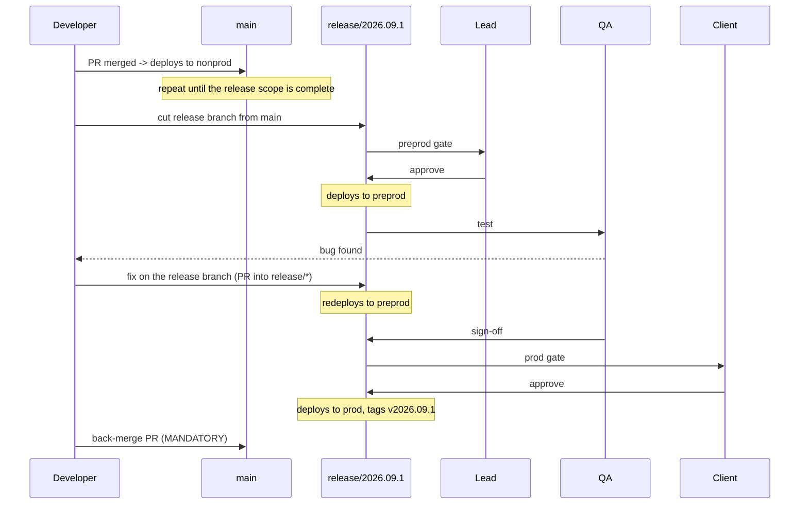

# 07 — Release process

[← Environments and access](06-environments-and-access.md) · [Start here](00-START-HERE.md)

---

## Who does what

| Role | Does |
|---|---|
| **Developer** | Ships to `main`; fixes preprod bugs on the release branch; back-merges |
| **Release manager** (rotating lead) | Cuts the branch, writes release notes, drives the checklist |
| **Lead** | Approves the preprod gate; reviews PRs |
| **QA** | Tests preprod; raises bugs; gives sign-off |
| **Client approver** | Approves the prod gate |

---

## The timeline



---

## 1. Cut the release

Release manager, when `main` holds the intended scope:

```bash
git checkout main
git pull
git log --oneline $(git describe --tags --abbrev=0)..HEAD    # what is going out
git checkout -b release/2026.09.1
git push -u origin release/2026.09.1
```

Pushing triggers every `cd-*` pipeline whose paths changed. Each builds, then **stops
at the preprod gate**. Nothing has deployed yet.

### Release notes

From the log above. Include:

- Every ticket ID and one line each
- **Which bundles changed** — that determines which pipelines run
- Any change to `conf/<use_case>/sources.yml` (new or retired sources)
- Any change to `ops.*` DDL (the bootstrap job will apply it)
- Any change to a `conf/reconciliation.yml`, especially a new or widened tolerance
- Anything needing manual action: a new secret, a new cluster policy, a grant

Post them where the approvers will see them before they click approve.

### If the platform bundle changed

`cd-platform` must complete in an environment **before** the module pipelines run
there. Approve its preprod gate first, let it finish, then approve the modules.

Usually irrelevant — the platform bundle changes rarely. It matters when you have
added a schema, a volume or a `ops` column.

---

## 2. Deploy to preprod

A lead approves the `dbx-preprod` gate. The pipeline:

1. Downloads the wheels built in the `Build` stage
2. `databricks bundle validate --target preprod`
3. `databricks bundle deploy --target preprod`
4. `databricks bundle summary --target preprod`
5. Runs the smoke job and **fails the stage if the run fails**

### Before approving, a lead should check

- [ ] `Build` is green — lint and tests passed
- [ ] Nonprod has been running this code without failures
- [ ] Release notes exist and list any manual steps
- [ ] Any new secret is already in `kv-edp-preprod`
- [ ] If `cd-platform` is part of this release, it has already deployed

---

## 3. QA tests preprod

QA works in the preprod workspace with `edp-qa` rights: view jobs, trigger runs, read
data. No deploy rights, no ability to edit a notebook.

### What to test

**Did it deploy?** Jobs are present, correctly named, schedules unpaused, tags right.

**Did it run?**

```sql
SELECT task_key, status, started_at, duration_seconds, error_message
FROM edp_ops_preprod.audit.job_run
WHERE started_at >= current_date()
ORDER BY started_at DESC;
```

**Did data land?**

```sql
SELECT source_id, target_table, rows_written, watermark_from, watermark_to, loaded_at
FROM edp_ops_preprod.audit.table_load
WHERE loaded_at >= current_date()
ORDER BY loaded_at DESC;
```

**Is it any good?**

```sql
SELECT table_name, expectation_name, severity, rows_evaluated, rows_failed, passed
FROM edp_ops_preprod.audit.data_quality_result
WHERE evaluated_at >= current_date() AND NOT passed;
```

**Does the business logic hold?** Row counts against source, spot-check known
records, reconcile totals, verify the specific tickets in this release.

### Raising a bug

Raise a work item, link it to the release, and say precisely: which job, which run
ID, which table, expected versus actual. The run ID makes it findable in
`job_run_audit`.

Then a developer follows [02 §5](02-branching-strategy.md#5-fixing-a-bug-found-in-preprod):
fix on a branch off `release/*`, PR **into the release branch**, which redeploys
preprod for retest.

> QA never gets a "quick fix" applied directly in the preprod workspace. It would be
> erased by the next deploy and would exist in no branch. If someone offers, say no.

### Sign-off

QA states explicitly, on the work item: tested, and either passed or these bugs
remain. The client approver reads that before approving prod.

---

## 4. Deploy to prod

A client approver approves the `dbx-prod` gate.

The prod stage deploys **the same commit and the same wheels** that preprod ran. Not
a rebuild — the actual artifact from the `Build` stage of that run.

### Before approving, the client should have

- [ ] QA sign-off recorded
- [ ] Release notes read
- [ ] Any open bug from preprod either fixed and retested, or explicitly accepted
- [ ] The deployment window agreed (if a business-hours check is configured)

### Tag it

```bash
git checkout release/2026.09.1
git pull
git tag -a v2026.09.1 -m "Release 2026.09.1"
git push origin v2026.09.1
```

The tag records what production is running. It is the branch point for the next
hotfix.

---

## 5. Back-merge

**The release is not finished until this is merged.**

```bash
git checkout main
git pull
git checkout -b backmerge/release-2026.09.1
git merge origin/release/2026.09.1
pwsh ./scripts/dev/Validate-All.ps1
git push -u origin backmerge/release-2026.09.1
```

PR into `main`, titled `Back-merge release/2026.09.1`.

If the release branch had no fix commits, this is a no-op merge and takes a minute.
If it had fixes, this is what stops you shipping the same bug again next month.

---

## The release checklist

Copy into the release work item.

**Cut**
- [ ] `main` is green and holds the intended scope
- [ ] `release/<version>` cut from `main` and pushed
- [ ] Release notes written and circulated
- [ ] Manual prerequisites done (secrets, policies, grants)

**PreProd**
- [ ] `cd-platform` approved and complete (if the platform bundle changed)
- [ ] Module pipelines approved by a lead
- [ ] All deploys green, smoke runs passed
- [ ] QA notified

**Test**
- [ ] Deployment verified — jobs present, named, scheduled
- [ ] Runs verified in `job_run_audit`
- [ ] Data verified in `table_load_audit`
- [ ] Data quality verified in `data_quality_result`
- [ ] Business logic verified per ticket
- [ ] Bugs raised, fixed on the release branch, retested
- [ ] **QA sign-off recorded**

**Prod**
- [ ] Client approver has the notes and the sign-off
- [ ] Prod gate approved
- [ ] Deploy green, smoke run passed
- [ ] First scheduled run monitored
- [ ] `v<version>` tag pushed

**Close**
- [ ] **Back-merge PR merged to `main`**
- [ ] Release branch left in place until the next release (it is the hotfix base)
- [ ] Work items closed

---

## 6. Rollback

DABs has no "undo". Two options, and the first is usually right.

### Roll forward (preferred)

Fix the problem, deploy the fix. Faster than a rollback in almost every case, and it
leaves you in a known state rather than a mixed one.

### Redeploy the previous tag

```bash
git checkout -b rollback/2026.09.1-to-2026.08.3 v2026.08.3
git push -u origin rollback/2026.09.1-to-2026.08.3
```

Then run the `cd-*` pipeline manually against that branch, targeting prod. It will
still stop at the client gate — that is correct; a rollback is a production
deployment.

> ### Code rolls back. Data does not.
>
> If the bad release wrote to a table, redeploying old code does not remove those
> rows. Delta time travel is your friend:
>
> ```sql
> DESCRIBE HISTORY edp_curated_prod.us1.orders;
> RESTORE TABLE edp_curated_prod.us1.orders TO VERSION AS OF 42;
> ```
>
> Check `ops.audit.table_load` for the run that did it, and check
> `ops.config.landing_watermark` — if a watermark advanced past bad data, reset it or the
> next run will skip the rows you need to reload.

---

## 7. New environment

Full sequence in [06 §7](06-environments-and-access.md#7-standing-up-a-new-environment).
The Databricks-specific part, in order:

```bash
# 1. Platform bundle FIRST - creates catalogs, schemas, volumes, scopes
#    (run the cd-platform pipeline against the new target)

# 2. Apply the control/audit DDL
databricks bundle run platform_bootstrap_ops --target <env>

# 3. Module bundles
#    (run cd-landing, cd-us1, cd-us1)

# 4. Seed the ingestion source registry
databricks bundle run landing_seed_source_registry --target <env>

# 5. Verify
databricks bundle summary --target <env>
```

---

[← Environments and access](06-environments-and-access.md) · [Next: Troubleshooting →](08-troubleshooting.md)
