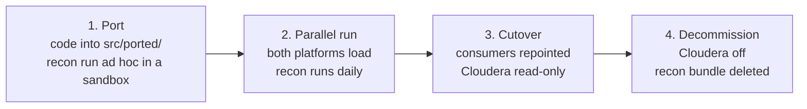

# 13 — Migration and cutover

[← Conventions](12-conventions.md) · [Start here](00-START-HERE.md)

How a use case gets from "running on Cloudera" to "running on Databricks, and we
can prove it is correct".

---

## The question this answers

For a lift and shift, the client is not really asking *did it deploy?*. They are
asking:

> **Does Databricks produce the same numbers Cloudera did?**

Without a structured answer, go-live is a judgement call and every discrepancy
found afterwards is a crisis. With one, every use case carries a dated, queryable
parity record and cutover becomes a query.

That record is `edp_ops_<env>.recon`, written by the **recon bundle**.

---

## 1. Why reconciliation is its own bundle

This is the structural decision that shapes everything below, and it is worth
understanding before the mechanics.

Reconciliation has a different **owner**, a different **identity** and a different
**lifespan** from the ETL it checks.

| | Use-case bundles (`us1`–`us5`) | Recon bundle |
|---|---|---|
| Owner | The use-case dev team | **QA** |
| Writes | curated + datamart data | **only** `ops.recon` |
| Reads | its own landing + curated | **every** data catalog |
| Pipeline | `cd-us1` … `cd-us5` | `cd-recon` |
| Lifespan | permanent | **deleted at decommission** |

Putting recon inside a use-case bundle breaks all three:

**Owner.** A QA tolerance change becomes a PR into the dev team's bundle — which
triggers `cd-us1` and **redeploys production ETL jobs**. A validation change must
never be able to do that. The reverse is equally wrong: a dev team shipping an ETL
change should not redeploy the checks that are validating them.

**Identity.** The recon job needs `SELECT` on every data catalog (it reads both
sides) and `MODIFY` on nothing but `ops.recon`. The ETL run-as identity is the
opposite shape. Only separate bundles let each have exactly what it needs — and it
means **a use case cannot write its own exam results**.

**Lifespan.** Recon exists for the migration. At decommission the bundle, its
library and its pipeline are deleted in **one PR that touches no production ETL at
all**.

### One framework, five configs

The framework is deliberately generic. For a lift and shift, every use case is the
same job: *compare this target table against that source table*. Nothing in
`libs/edp_recon` or `bundles/recon/src/jobs/reconcile.py` knows about us1 or us2.

```
bundles/recon/
  conf/us1.yml … us5.yml          <- the only per-use-case artefact
  resources/recon_us1.job.yml …   <- one job per use case, same notebook
  src/jobs/reconcile.py           <- ONE notebook, all five use cases
libs/edp_recon/
  model.py    the contract: checks, targets, the SQL each measures
  gate.py     "did the ETL actually run?"
```

Onboarding a sixth use case is a config file and a job entry. Never code.

**One job per use case** rather than one job for all five, so they schedule, fail
and retire independently: us2 can cut over and have its job removed while us4 is
still in parallel run.

### Whose tables does recon check?

Recon **consumes** tables it does not produce, so in a sandbox it has to be told
whose output to look at. There is no safe default, because the two sandbox users
want opposite things:

| Who | Wants | Why |
|---|---|---|
| **QA** authoring a config | the **shared** tables | QA never runs ETL; their own sandbox schema is empty |
| **A developer** checking a port | **their own** tables | Reading shared would check code they did not write |

So it is explicit, using the same `upstream_mode` mechanism as everything else:

```bash
# QA, testing a new check against real pipeline output (the default)
databricks bundle run recon_us1 --target dev

# A developer, checking their own port before handing it over
databricks bundle run recon_us1 --target dev --params upstream_mode=sandbox
```

The default is `shared` rather than `sandbox` because of which failure is worse.
A developer who forgets the flag compares shared tables and gets a **PASS about
code they did not write** — a false pass on the migration gate, the most expensive
failure available here. So the run prints a banner in a sandbox saying exactly
which schema it compared, and tells you the flag if you took the default.

In preprod and prod the setting is meaningless: `schema_prefix` is empty, so both
modes name the same table. There is no environment branch to get wrong.

**The ETL gate follows the same mode.** Checking the shared audit log while
comparing sandbox tables would answer about a different run entirely.

**Sandbox results are never cutover evidence.** Writes stay prefixed regardless of
read mode, so a sandbox run lands in `jsmith_recon.parity_run` and the shared
evidence base never sees it. `cutover_readiness` needs no filter for this — the
rows are simply not in the schema it reads.

---

## 2. The four phases



| Phase | Cloudera | Databricks | Recon | Who drives |
|---|---|---|---|---|
| 1. Port | authoritative | sandbox only | ad hoc, in a sandbox | Dev, with QA writing the config |
| 2. Parallel run | authoritative | running in prod, not consumed | **daily, preprod and prod** | QA |
| 3. Cutover | read-only | **authoritative** | daily, still both | QA + client |
| 4. Decommission | off | authoritative | bundle deleted | Platform leads |

Phase 2 is the one people try to skip. It is the phase that makes phase 3 safe.

### When each team touches recon

- **Phase 1** — QA writes `conf/<uc>.yml` with the use-case team, who know which
  tables matter. A developer can run `recon_<uc>` in their own sandbox to check
  their port before handing it over: `Deploy-Sandbox.ps1 -Bundle recon`.
- **Phase 2** — QA owns it entirely. They can trigger a re-check in preprod *and*
  prod (`CAN_MANAGE_RUN` on the recon jobs) without being able to deploy anything.
- **Phase 3** — QA and the client read `cutover_readiness` together.
- **Phase 4** — Platform leads delete it.

---

## 3. Declaring what parity means

`bundles/recon/conf/<use_case>.yml`, owned by QA, co-reviewed by the use-case team:

```yaml
use_case: us1

targets:
  - name: orders_curated
    layer: curated
    target_table: orders
    source_ref: edp_ops_prod.recon.legacy_us1_orders
    key_columns: [orders_id]
    owner_email: edp-us1-team@example.com
    checks:
      - name: row_count
        check_type: row_count
      - name: orders_id_hash
        check_type: column_hash
        column: orders_id
```

### The five check types

| Type | Measures | Catches |
|---|---|---|
| `row_count` | `count(*)` | Missing or duplicated rows |
| `distinct_count` | `count(DISTINCT col)` | Duplicate keys, lost keys |
| `column_sum` | `sum(col)` | Value drift in numerics |
| `column_hash` | `sum(crc32(col))` | Value-level drift a count cannot see |
| `min_max` | `max - min` | Range shifts, truncated loads |

`column_hash` is the important one. Row counts match far more often than contents
do — same number of rows, different values, is the classic silent migration
defect. The hash aggregates commutatively (`sum` of `crc32`), so the two platforms
need not agree on row order.

A test enforces that **every use case has at least one value-level check**, because
a config of nothing but row counts would pass a table whose every value was wrong.

### `source_ref` is deliberately opaque

It is just a queryable name. How you get the Cloudera side into Databricks is a
project decision, and all three of these work:

| Approach | `source_ref` | When |
|---|---|---|
| Exported extract landed on a volume | `edp_ops_prod.recon.legacy_us1_orders` | Default — simplest, most auditable |
| Lakehouse Federation / JDBC view | a view over the federated table | Cloudera reachable from Databricks |
| Hive metastore table read directly | the HMS table name | Same-cluster migration |

The `edp-legacy` secret scope and the `recon.legacy_extracts` volume exist for the
first approach. Both are deleted at phase 4.

A test rejects a `source_ref` pointing at a Databricks *data* catalog — that would
compare a table against itself and pass forever.

### Tolerances must be justified — enforced in code

```yaml
      - name: amount_sum
        check_type: column_sum
        column: amount
        tolerance: 0.0001
        justification: >-
          Cloudera stores amount as DOUBLE and Databricks as DECIMAL(18,2);
          accumulated float representation differs in the 5th decimal place
          across ~2M rows. Verified against a hand-reconciled sample on
          2026-08-14 by QA with the us1 team.
```

`ReconCheck.__post_init__` **raises** if a non-zero tolerance has no
justification. That is not a review convention that erodes under deadline
pressure — it is a test failure. A second test caps tolerance at 1%: above that it
is not a rounding allowance, it is a decision to accept different numbers, and
that needs a conversation rather than a config edit.

> **Zero on the legacy side never passes.** If Cloudera measured 0 and Databricks
> measured 40,000, no relative tolerance makes that acceptable — `passed()` returns
> False regardless. That is exactly the case where a tolerance would otherwise hide
> a total failure.

---

## 4. The ETL gate — why a decoupled schedule needs one

Recon runs on its own schedule (08:00), after the datamart build (06:00). It does
**not trust that offset**.

Before comparing anything, `reconcile.py` queries `ops.audit.job_run` for a
successful ETL run for *this use case* in *this environment* within
`etl_window_hours`. If there is none, it records the run as **SKIPPED** rather
than comparing stale output.

Why this matters: comparing yesterday's Databricks output against today's Cloudera
extract produces a mismatch that looks exactly like a migration defect. Chasing one
costs a day — and worse, it teaches people that recon failures are usually noise,
which is precisely the belief that makes the real failure get ignored.

**SKIPPED is not clean.** `cutover_readiness` counts only clean runs, so a use case
whose ETL keeps failing never accumulates the consecutive passes it needs. The gate
cannot be used to quietly avoid the check.

---

## 5. Running it

```bash
# QA, re-checking preprod on demand (no deploy rights needed)
databricks bundle run recon_us1 --target preprod

# A developer checking their own port, against their own sandbox tables
pwsh ./scripts/dev/Deploy-Sandbox.ps1 -Bundle recon
databricks bundle run recon_us1 --target dev
```

Both sides are measured with **the same SQL**, built from the same `ReconCheck`. A
difference can only come from the data, never from two different queries. That
property is what makes the result trustworthy, and it is unit-tested in
[`test_model.py`](../libs/edp_recon/tests/test_model.py).

**A parity failure is a finding, not a job failure.** The job completes and records
the mismatch. A red job nobody can query tells you less than a green job with a row
in `parity_check_result`. QA is notified on success as well as failure — otherwise
a daily mismatch would be silent.

---

## 6. Reading the results

**Is us1 ready?**

```sql
SELECT * FROM edp_ops_preprod.recon.cutover_readiness WHERE use_case = 'us1';
```

```
use_case env      total_runs clean_runs skipped_runs last_run_at          last_run_clean
us1      preprod  14         12         1            2026-08-30 08:04:11  true
```

`cutover_readiness` is a **view**, not a table, so it can never drift from the
evidence underneath it. A run is clean only when *every* target in it passed — one
failing table means the use case is not ready, however good the others look.

**What failed?**

```sql
SELECT target_name, check_name, legacy_metric, target_metric,
       difference, relative_diff, tolerance
FROM edp_ops_preprod.recon.parity_check_result
WHERE use_case = 'us1' AND NOT passed
  AND evaluated_at >= current_date() - INTERVAL 7 DAYS
ORDER BY evaluated_at DESC;
```

**Why was a run skipped?**

```sql
SELECT recon_run_id, target_name, status, notes
FROM edp_ops_preprod.recon.parity_run
WHERE use_case = 'us1' AND status = 'SKIPPED'
ORDER BY started_at DESC LIMIT 10;
```

`notes` carries the gate's reason, in words, for whoever reads it days later.

---

## 7. The cutover gate

A use case is cleared when **all** of these hold:

- [ ] **N consecutive clean runs in preprod.** Agree N with the client per use
      case; 5 is a reasonable default, 10 for anything financial. Worth negotiating
      up front rather than at go-live.
- [ ] **N consecutive clean runs in prod during the parallel run.** Preprod proves
      the logic; prod proves it at real volume with real data skew.
- [ ] **No skipped runs in the window** — or if there are, the ETL failures behind
      them are understood and closed.
- [ ] **Every open tolerance is justified and signed off by QA and the client.**
- [ ] **No `error`-severity data quality breach** in `ops.audit.data_quality_result`
      for the use case in the same window.
- [ ] **A month-end (or equivalent peak) has been included.** Migrations that pass
      every day for three weeks routinely fail their first period close.
- [ ] **Consumers identified and repointed** — reports, extracts, downstream jobs.
- [ ] **Rollback rehearsed**, not just documented.

Recorded on the cutover work item with the query output pasted in. The evidence is
a query result, not an assertion.

### Why prod parallel-run matters even after preprod is green

Preprod has a subset of data, and it is usually a clean subset. Production has the
row with a null in a column that has never been null, the encoding nobody
documented, the partition three times bigger than the rest. The parallel run is
where those surface — while Cloudera is still authoritative.

---

## 8. Cutting over

1. Confirm the gate above.
2. Repoint consumers to `edp_datamart_prod.<uc>`.
3. Make the Cloudera job **read-only** — do not switch it off. Keep it loading a
   parallel copy if you can afford it.
4. **Leave recon running.** You still want the daily comparison.
5. Watch for at least one full business cycle, including a period close.
6. Then retire that use case's recon: delete `bundles/recon/conf/<uc>.yml` and
   `bundles/recon/resources/recon_<uc>.job.yml`. One PR, `cd-recon` only. The
   config test will fail if you delete one and not the other.

Retiring a use case's recon is a **deliberate, reviewed change**, not drift.

---

## 9. Decommissioning the whole thing

Once every use case has cut over:

```
delete  bundles/recon/
delete  libs/edp_recon/
delete  .azure-pipelines/cd-recon.yml
delete  the recon entries in CODEOWNERS
edit    bundles/_platform/resources/schemas_ops.yml   remove the recon schema
edit    bundles/_platform/resources/schemas_*.yml     remove the recon_sp grants
edit    bundles/_platform/resources/volumes.yml       remove legacy_extracts
edit    bundles/_platform/resources/secret_scopes.yml remove edp-legacy
edit    bundles/_platform/variables.yml               remove recon_sp
```

**Zero changes to any use-case bundle.** That is the whole payoff of the
separation, and it is why the structure is worth the extra bundle.

Archive `ops.recon` before dropping it — it is the audit trail of a migration, and
somebody will ask about it.

---

## 10. Rollback during a parallel run

This is why phase 3 keeps Cloudera warm.

| Situation | Action |
|---|---|
| Parity breaks after cutover | Repoint consumers back to Cloudera. Fix, re-prove, cut over again. |
| Databricks job fails | Cloudera output is still current if you kept it loading. Repoint. |
| Wrong data already published | `RESTORE TABLE … TO VERSION AS OF n`, then check `ops.config.landing_watermark` — if a watermark advanced past bad data, reset it or the next run skips the rows you need. |

Code rolls back. Data does not. See [07 §6](07-release-process.md#6-rollback).

---

## 11. Tracking progress

**How much is still lifted rather than refactored?**

```bash
find bundles/*/src/ported -name "*.py" ! -name "example_*" | wc -l
```

**Which use cases are reconciling at all?**

```sql
SELECT use_case, env, count(*) AS runs,
       sum(CASE WHEN status = 'SKIPPED' THEN 1 ELSE 0 END) AS skipped,
       max(started_at) AS last_run
FROM edp_ops_prod.recon.parity_run
WHERE started_at >= current_date() - INTERVAL 30 DAYS
GROUP BY use_case, env ORDER BY use_case;
```

A use case with **no** rows here is not passing — it is not being checked. That is
the more dangerous state, and it is the one a green dashboard hides.

---

[← Conventions](12-conventions.md) · [Next: Porting guide →](14-porting-guide.md)
