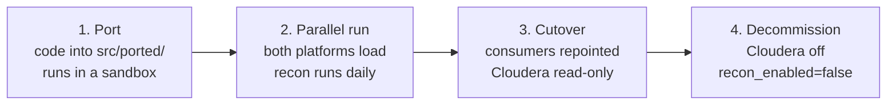

# 13 — Migration and cutover

[← Conventions](12-conventions.md) · [Start here](00-START-HERE.md)

How a use case gets from "running on Cloudera" to "running on Databricks, and we
can prove it is correct".

---

## The question this answers

For a lift and shift, the client is not really asking *did it deploy?*. They are
asking:

> **Does Databricks produce the same numbers Cloudera did?**

Without a structured answer, go-live is a judgement call and every discrepancy
found afterwards is a crisis. With one, every use case carries a dated, queryable
parity record and cutover becomes a query.

That record is `edp_ops_<env>.recon`.

---

## 1. The four phases



| Phase | Cloudera | Databricks | Recon |
|---|---|---|---|
| 1. Port | authoritative | sandbox only | ad hoc |
| 2. Parallel run | authoritative | running in prod, not consumed | **daily, both platforms** |
| 3. Cutover | running, read-only | **authoritative** | daily, still both |
| 4. Decommission | off | authoritative | off (`recon_enabled: false`) |

Phase 2 is the one people try to skip. It is the phase that makes phase 3 safe.

---

## 2. Declaring what parity means

Each use case owns `bundles/<uc>/conf/reconciliation.yml`:

```yaml
use_case: us1

targets:
  - name: orders_curated
    layer: curated
    target_table: orders
    source_ref: edp_ops_nonprod.recon.legacy_us1_orders
    key_columns: [orders_id]
    owner_email: edp-us1-team@example.com
    checks:
      - name: row_count
        check_type: row_count

      - name: orders_id_hash
        check_type: column_hash
        column: orders_id
```

### The five check types

| Type | Measures | Catches |
|---|---|---|
| `row_count` | `count(*)` | Missing or duplicated rows |
| `distinct_count` | `count(DISTINCT col)` | Duplicate keys, lost keys |
| `column_sum` | `sum(col)` | Value drift in numerics |
| `column_hash` | `sum(crc32(col))` | Value-level drift a count cannot see |
| `min_max` | `max - min` | Range shifts, truncated loads |

`column_hash` is the important one. Row counts match far more often than contents
do — same number of rows, different values, is the classic silent migration
defect. The hash aggregates commutatively (`sum` of `crc32`), so the two platforms
need not agree on row order.

### `source_ref` is deliberately opaque

It is just a queryable name. How you get the Cloudera side into Databricks is a
project decision, and all three of these work:

| Approach | `source_ref` | When |
|---|---|---|
| Exported extract landed on a volume | `edp_ops_prod.recon.legacy_us1_orders` | Default — simplest, most auditable |
| Lakehouse Federation / JDBC view | a view over the federated table | Cloudera reachable from Databricks |
| Hive metastore table read directly | the HMS table name | Same-cluster migration |

The `edp-legacy` secret scope and the `recon.legacy_extracts` volume exist for the
first approach. Both are deleted at phase 4.

### Tolerances must be justified — enforced in code

```yaml
      - name: amount_sum
        check_type: column_sum
        column: amount
        tolerance: 0.0001
        justification: >-
          Cloudera stores amount as DOUBLE and Databricks as DECIMAL(18,2);
          accumulated float representation differs in the 5th decimal place
          across ~2M rows. Verified against a hand-reconciled sample on
          2026-08-14 by the us1 team.
```

`ReconCheck.__post_init__` **raises** if a non-zero tolerance has no
justification. That is not a review convention that erodes under deadline
pressure — it is a test failure.

Default is `0.0`, meaning exact. Reach for a tolerance only when you have
explained the difference, not when you are tired of it failing.

> **Zero on the legacy side never passes.** If Cloudera measured 0 and Databricks
> measured 40,000, no relative tolerance makes that acceptable —
> `ReconCheck.passed` returns False regardless. That is the case where a tolerance
> would otherwise hide a total failure.

---

## 3. Running it

The `<uc>_reconcile` job runs at 08:00 UTC, after the datamart build, throughout
the parallel-run period.

```bash
databricks bundle run us1_reconcile --target preprod
```

Both sides are measured with **the same SQL**, built from the same `ReconCheck`.
A difference can only come from the data, never from two different queries. That
property is what makes the result trustworthy, and it is unit-tested in
[`test_recon.py`](../libs/dab_common/tests/test_recon.py).

**A parity failure is a finding, not a job failure.** The job completes and records
the mismatch. A red job nobody can query tells you less than a green job with a
row in `parity_check_result`.

---

## 4. Reading the results

**Is us1 ready?**

```sql
SELECT * FROM edp_ops_preprod.recon.cutover_readiness WHERE use_case = 'us1';
```

```
use_case  env      total_runs  clean_runs  last_run_at          last_run_clean
us1       preprod  14          12          2026-08-30 08:04:11  true
```

`cutover_readiness` is a **view**, not a table, so it can never drift from the
evidence underneath it. A run is clean only when *every* target in it passed — one
failing table means the use case is not ready, however good the others look.

**What failed?**

```sql
SELECT target_name, check_name, legacy_metric, target_metric,
       difference, relative_diff, tolerance
FROM edp_ops_preprod.recon.parity_check_result
WHERE use_case = 'us1' AND NOT passed
  AND evaluated_at >= current_date() - INTERVAL 7 DAYS
ORDER BY evaluated_at DESC;
```

**Which rows?**

```sql
SELECT key_values, legacy_value, target_value
FROM edp_ops_preprod.recon.parity_exception
WHERE recon_run_id = '<the run id>' LIMIT 100;
```

`parity_exception` is capped per run. It is for diagnosis, not a full diff.

---

## 5. The cutover gate

A use case is cleared when **all** of these hold:

- [ ] **N consecutive clean runs in preprod.** Agree N with the client per use
      case; 5 is a reasonable default, 10 for anything financial. This is the one
      number worth negotiating up front rather than at go-live.
- [ ] **N consecutive clean runs in prod during the parallel run.** Preprod proves
      the logic; prod proves it at real volume with real data skew.
- [ ] **Every open tolerance is justified and signed off by QA and the client.**
- [ ] **No `error`-severity data quality breach** in `ops.audit.data_quality_result`
      for the use case in the same window.
- [ ] **A month-end (or equivalent peak) has been included.** Migrations that pass
      every day for three weeks routinely fail their first period close.
- [ ] **Consumers identified and repointed** — reports, extracts, downstream jobs.
- [ ] **Rollback rehearsed**, not just documented.

Recorded on the cutover work item, with the query output pasted in. The evidence
is a query result, not an assertion.

### Why prod parallel-run matters even after preprod is green

Preprod has a subset of data, and it is usually a clean subset. Production has the
row with a null in a column that has never been null, the encoding nobody
documented, the partition three times bigger than the rest. The parallel run is
where those surface — while Cloudera is still authoritative.

---

## 6. Cutting over

1. Confirm the gate above.
2. Repoint consumers to `edp_datamart_prod.<uc>`.
3. Make the Cloudera job **read-only** — do not switch it off. Keep it loading a
   parallel copy if you can afford it.
4. Keep `recon_enabled: "true"`. You still want the daily comparison.
5. Watch for at least one full business cycle, including a period close.
6. Then phase 4: `recon_enabled: "false"` in prod, decommission Cloudera, drop the
   `recon.legacy_extracts` volume and the `edp-legacy` secret scope.

Turning recon off is a **deliberate, reviewed change** to `databricks.yml`, not
something that happens by drift. It is the last commit of the migration.

---

## 7. Rollback during a parallel run

This is the reason phase 3 keeps Cloudera warm.

| Situation | Action |
|---|---|
| Parity breaks after cutover | Repoint consumers back to Cloudera. Fix, re-prove, cut over again. |
| Databricks job fails | Cloudera output is still current if you kept it loading. Repoint. |
| Wrong data already published | `RESTORE TABLE … TO VERSION AS OF n`, then check `ops.config.landing_watermark` — if a watermark advanced past bad data, reset it or the next run skips the rows you need. |

Code rolls back. Data does not. See [07 §6](07-release-process.md#6-rollback).

---

## 8. Tracking progress

**How much is still lifted rather than refactored?**

```bash
find bundles/*/src/ported -name "*.py" ! -name "example_*" | wc -l
```

**Which use cases are reconciling at all?**

```sql
SELECT use_case, env, count(*) AS runs, max(started_at) AS last_run
FROM edp_ops_prod.recon.parity_run
WHERE started_at >= current_date() - INTERVAL 30 DAYS
GROUP BY use_case, env ORDER BY use_case;
```

A use case with **no** rows here is not passing — it is not being checked. That is
the more dangerous state, and it is the one a "green dashboard" hides.

---

[← Conventions](12-conventions.md) · [Next: Porting guide →](14-porting-guide.md)
